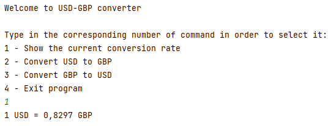
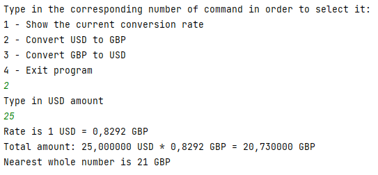

# USD-GBP-Converter
Utility that converts USD to GBP and vice-versa using actual conversion rate.

## How to use
Type in the number of desired command and follow the instructions.
Utility can show the actual conversion rate, convert from USD to GBP and vice-versa.
Also, it shows the rounded amount for convenience.

## How to launch

Clone repository to your local machine
```
git clone https://github.com/archer-man/USD_GBP_Converter
```

Build Docker image
```
sudo docker build -t usd_gbp_converter
```

Run Docker image
```
sudo docker run -p 8080:8080 usd_gbp_converter
```

## Example
This example shows how to see the actual conversion rate, which will be updated from the Internet. We've written number 1 in order to choose this command.



This example shows how we convert from USD to GBP. First we specify the command number 2 and then the amount we want to convert.


